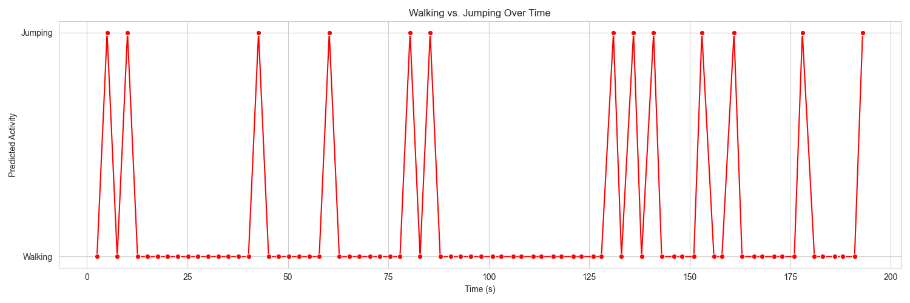

# Activity Recognition: Walking vs. Jumping Classification

## **Overview**

Welcome to the **Activity Recognition** application! This tool leverages machine learning to classify activities based on accelerometer data collected from your smartphone. Whether you're tracking your fitness routines or conducting research, this app provides insightful classifications of walking and jumping activities.

## **Features**

- **Data Upload:** Easily upload your accelerometer data in CSV format.
- **Data Preprocessing:** Automatically handles data cleaning and segmentation.
- **Feature Extraction:** Extracts key statistical features from your data segments.
- **Prediction:** Utilizes a trained Random Forest model to classify activities.
- **Visualization:** Interactive plots to visualize activity patterns over time.
- **Download Results:** Export your prediction results for further analysis.

## **How It Works**

1. **Data Collection:**
   - Use the [phyphox](https://phyphox.org/) app on your smartphone to collect accelerometer data.
   - Ensure the CSV file includes the required columns:
     - `Time (s)`
     - `Acceleration x (m/s²)`
     - `Acceleration y (m/s²)`
     - `Acceleration z (m/s²)`
     - `Absolute acceleration (m/s²)`

2. **Launching the App:**
   - Clone this repository to your local machine.
   - Navigate to the project directory.
   - Install the required dependencies:
     ```bash
     pip install -r requirements.txt
     ```
   - Run the Streamlit app:
     ```bash
     streamlit run app.py
     ```

3. **Using the App:**
   - **Upload Data:** Click on the **"📥 Upload Accelerometer Data CSV"** section and upload your CSV file.
   - **View Results:** The app will display:
     - **Data Preview:** A snapshot of your uploaded data.
     - **Data Preprocessing:** Information about data cleaning and segmentation.
     - **Feature Extraction:** Overview of extracted features from your data.
     - **Predictions:** Classification results indicating whether each segment is Walking or Jumping.
     - **Activity Plot:** Visual representation of your activities over time.
   - **Download Predictions:** Use the **"💾 Download Prediction Results"** section to export your results as a CSV file.

**Project Structure:**
  - Organize your repository files as follows:
    ```
    activity-recognition-app/
    ├── app.py
    |
    ├── models/
    │   ├── random_forest_model.pkl
    │   └── scaler.pkl
    ├── plots/
    ├── sample_data.csv
    ├── requirements.txt
    ├── README.md
    └── .gitignore
    ```

## **Example: Running the App with Sample Data**

To help you get started quickly, we've included a `sample_data.csv` file in the `datasets/` directory. Follow the steps below to see the app in action:

1. **Locate the Sample Data:**
   - Navigate to the `datasets/` folder in your project directory.
   - Find the `sample_data.csv` file, which contains example accelerometer readings.

2. **Upload the Sample Data:**
   - Open the Streamlit app by running:
     ```bash
     streamlit run app.py
     ```
   - In the app interface, click on the **"📥 Upload Accelerometer Data CSV"** section.
   - Select and upload the `sample_data.csv` file from the `datasets/` folder.

3. **View the Output:**
   - After uploading, the app will process the data and display various sections as described in the **Using the App** section.
   - **Example Output Graph:**
     
     
     *Activity Plot: Visualization of walking and jumping activities over time.*

4. **Download the Predictions:**
   - Scroll down to the **"💾 Download Prediction Results"** section.
   - Click the **"Download Predictions as CSV"** button to save your results locally.
